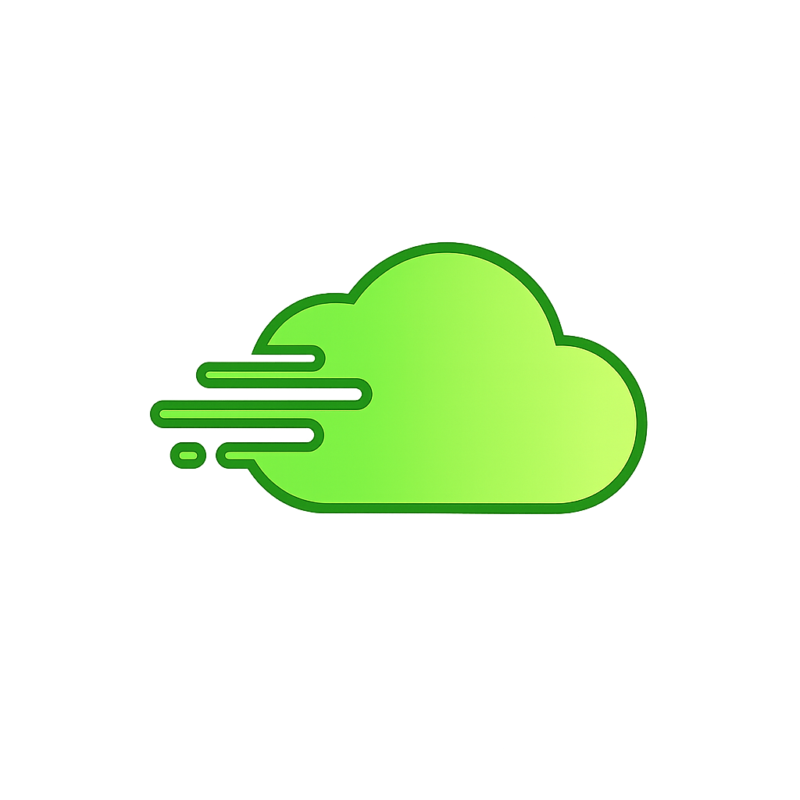
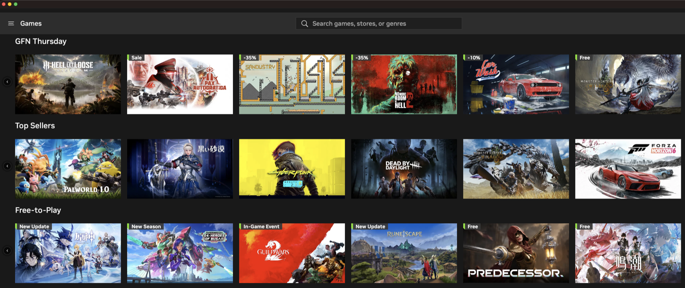
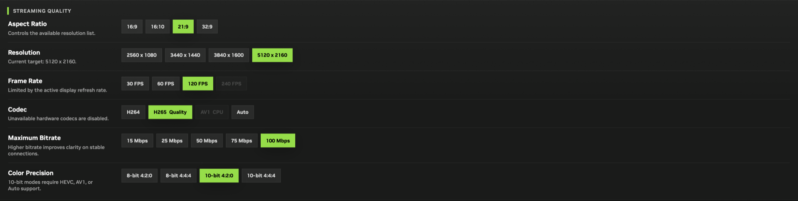
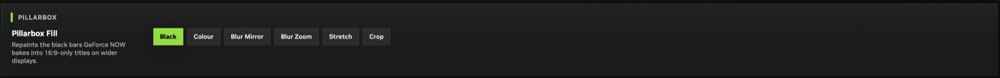
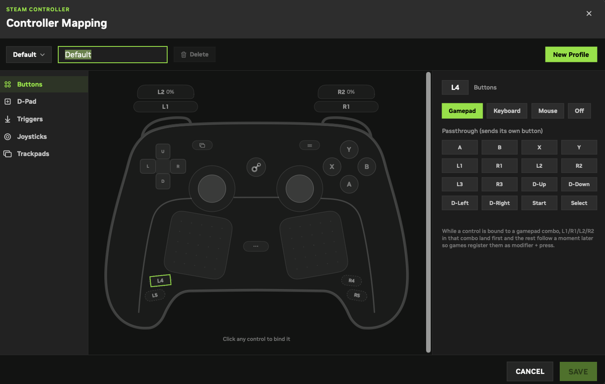
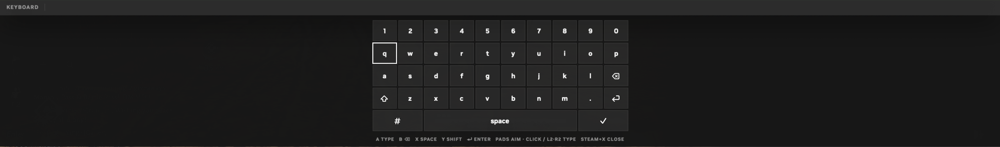

<div align="center">



# OpenNOW

**A native macOS client for GeForce NOW - built for Mac, built for controllers.**

[**⬇ Download the latest release**](../../releases) · [What's new](CHANGELOG.md) · [Build from source](#build-from-source)

[](LICENSE)


**Independent community project.** Not affiliated with, endorsed by, or sponsored by NVIDIA.

---

> ### 🙏 Special Thanks
> Huge thanks to **[@Jayian1890](https://github.com/Jayian1890)** - the main contributor of **all base and core functionality** of **openNOW-Mac**. This project stands on that foundation.

<br>



</div>

---

## Why OpenNOW

OpenNOW is written in SwiftUI from the ground up and driven by the same WebRTC and NVST streaming protocols the official desktop app uses - not a web view in a wrapper. The pitch is simple: **treat a Mac like a Mac, and treat a controller like a controller.** Browse your library and launch in seconds, stream at up to 5K, record the runs you want to keep, and play with a Steam Controller 2026 without ever installing Steam.

GeForce NOW works on a Mac, but the official client leaves a lot on the table - a mouse-and-keyboard web view, pillarbox bars baked into every ultrawide stream, and no love for the controllers people actually game with. OpenNOW fills those gaps with a real Mac app, and then keeps going.

| | |
|---|---|
| 🎮 **Steam Controller 2026 support** | Wired, Bluetooth LE, and both 2.4 GHz dongles. Full HID parsing, haptics, back grips, trackpads, custom mappings - no Steam required. |
| 🖥️ **Built for ultrawide** | 21:9 up to 5120×2160 and 32:9 up to 5120×1440, HEVC and AV1, and six ways to kill the black bars. [More ↓](#made-for-ultrawide) |
| 🔼 **Upscaling, on both transports** | Off, Spatial, or MetalFX, targeting 2K/4K/5K, with live Clarity and Noise Reduction sliders - gamepad-navigable, same on WebRTC and native NVST. [More ↓](#upscaling) |
| ⚡ **Native NVST transport** | Stream over NVIDIA's NVST protocol on OpenNOW's own native stack - RTSPS control, raw-SRTP video, VideoToolbox decode - with no vendor runtime in the bundle. [More ↓](#native-nvst-transport) |
| ⏺️ **Record your sessions** | One keystroke (⌘R) captures gameplay locally, with a browsable library and opt-in trim/crop/export editor. |
| 📚 **Your whole catalog** | Hero rotation, game rails, search and filters, store ownership picker, persistent Library and Favorites - plus a live banner that drops you straight back into an active session. |
| 🌐 **Remote Co-Op** | Invite a friend from a browser link and hand them a player slot in your session - signed invites, host-approved, native input path. |
| ⌨️ **On-screen keyboard in-stream** | Steam + X summons a Steam Deck-style keyboard right over the game - dual trackpads aim, L2/R2 or a pad click types. Tap the ⬍ key to flip it to the top of the screen when it overlaps something important. Works on any controller. |
| 💬 **Discord Rich Presence** | Your friends see what you're playing, automatically. |
| 🕹️ **Full controller navigation** | Drive the entire app - catalog, details, settings - from the pad. Never reach for the mouse. |
| 📊 **Real diagnostics** | Live stream HUD, session timers, network stats, and exportable logs when something goes wrong. |

## Install

1. Download `OpenNOW.dmg` from the [Releases](../../releases) page.
2. Open it and drag **OpenNOW** to Applications.
3. Launch from Spotlight. If macOS blocks it, right-click the app → **Open**.

Requires macOS 15.6 or later and your own GeForce NOW account.

## Made for Ultrawide

Pick your shape, then your resolution - 16:9, 16:10, 21:9, or 32:9. The wide end tops out at **5120×2160** on 21:9 and **5120×1440** on 32:9, all at 30/60/120/240 fps. HEVC carries true 5K streams where H.264 hardware decode runs out of headroom, and **AV1** leans in whenever bandwidth is the bottleneck, decoded in hardware on M3-and-later Apple silicon. 10-bit 4:2:0/4:4:4 colour is there when the codec supports it, and any codec your Mac can't decode greys itself out instead of failing mid-session.



### No more black bars

GeForce NOW bakes pillarbox columns into 16:9-only titles - real black pixels, not window padding, so a wide monitor is stuck with them. OpenNOW detects those bars in the incoming frames and lets you decide what fills them:



| Mode | What you get |
|---|---|
| **Black** | Leave the encoded bars alone. Zero cost, default. |
| **Colour** | Flat fill in any colour you pick. |
| **Blur Mirror** | Mirrors the picture edge outward, blurred. Seamless, no distortion. |
| **Blur Zoom** | Blown-up blurred copy of the frame behind the sharp image. |
| **Stretch** | Fills the full width, pushing distortion to the edges so the centre stays true. |
| **Crop** | Scales to fill and trims top and bottom. No bars, no warping - costs vertical view. |

Blur modes take an adjustable dim. Everything but **Black** runs through the custom Metal render path.

## Upscaling

Three tiers, three targets, and it's the same feature whether you're on WebRTC or native NVST - pick a resolution the game doesn't actually render at and let the client fill in the rest.

| Tier | What it does |
|---|---|
| **Off** | Present the decoded frame as-is. Zero cost, default. |
| **Spatial** | A custom Metal shader: edge-aware sharpen and denoise, tuned per source resolution. |
| **MetalFX** | Apple's spatial scaler, perceptual color processing, best detail reconstruction at a real GPU cost. |

Pick a target of **2K**, **4K**, or **5K** and the output caps there - never past your actual window or display size, so it never spends GPU time supersampling beyond what you'd see anyway. **Clarity** and **Noise Reduction** sliders tune the Spatial/MetalFX pass live, mid-stream. Every control - tier, target, both sliders - is gamepad-navigable from the in-stream HUD (⌘G), no mouse required.

## Native NVST Transport

WebRTC is the default, but it isn't the only way in. OpenNOW also speaks NVST - NVIDIA's native streaming protocol - on its own native stack, reproducing the exact pipeline the official client establishes, with no NVIDIA libraries in the bundle.

- **OpenNOW's own implementation, no vendor runtime** - an RTSPS-over-WSS control channel (OPTIONS → DESCRIBE → SETUP → ANNOUNCE → PLAY), a client-generated SRTP master key, and a video handoff derived from the seat's answers the same way the native client derives it.
- **Native video and input** - Mjolnir video access units (H.264, HEVC, and AV1) decode through VideoToolbox, while keyboard, mouse, text, and gamepad input plus audio ride the SCTP data channels of the seat's ICE/DTLS bundle.
- **Live native telemetry** - latency, jitter, bitrate, packet and frame loss in the in-stream stats HUD, plus a network governor that adapts bitrate to path conditions.
- **Scope limits** - microphone capture is accepted but not yet enabled on this path, and session recording is not yet available - use WebRTC if you want ⌘R captures.

Enable it in **Settings → Stream Transport → Native/NVST Transport**. Off keeps the default WebRTC session path.

The two-transport architecture is documented in [`docs/StreamTransportArchitecture.md`](docs/StreamTransportArchitecture.md).

## Steam Controller, Unlocked

OpenNOW talks to Valve's controllers directly over HID, so you get the pad in your GeForce NOW stream without Steam running in the background.

- **Every 2026 variant** - wired, BLE, and both dongles - plus the original 2015 controller.
- **Haptics, grips, trackpads** - rumble feedback, four back grips, and both pads parsed and bindable client-side.
- **Visual mapping editor** - click any control on the controller diagram and bind it to a gamepad button, a key, a mouse action, or nothing at all.
- **Combos on any control** - bind a back grip to `B + R2`; the modifier lands first, the press follows a beat later, so games read it as a real combo.
- **Profiles** - save as many as you like and switch between them.
- **Built-in tester** - Settings → Steam Controller Test shows every button, axis, and pad live.
- **Lizard mode off** - the firmware's keyboard/mouse emulation is suppressed so nothing leaks to the desktop.



### Steam + X On-Screen Keyboard



A Steam Deck-style overlay for logins, chat, and search fields in any GeForce NOW title. The keyboard works on **both the WebRTC and native NVST streaming paths** and sends keys exactly the way a physical keyboard does - UTF-8 text for characters, macOS keycodes for Return/Backspace.

- **Dual trackpads** each own one half of the grid. Touch a pad to aim, click it (or pull L2/R2) to type the aimed key.
- **No trackpads?** D-pad or left stick moves the grid cursor; A types, B is Backspace, X is Space, Y toggles Shift, Start presses Enter.
- **Overlapping game UI?** Tap the ⬍ position key in the bottom bar to flip the keyboard to the top of the screen.
- **Steam alone** still works as the local-cursor modifier - hold Steam to drive the Mac cursor with the right pad, same as before.

> Steam grabs the controller exclusively while it's running. Quit Steam first.

<details>
<summary><b>Supported hardware and report formats</b></summary>

<br>

| Product ID | Device |
|---|---|
| `0x1102` | Steam Controller (2015), wired |
| `0x1142` | Steam Controller (2015) wireless dongle |
| `0x1302` | Steam Controller (2026, "Triton"), wired |
| `0x1303` | Steam Controller (2026), Bluetooth LE |
| `0x1304` | Steam Controller (2026) 2.4 GHz dongle ("Proteus") |
| `0x1305` | Steam Controller (2026) dongle variant ("Nereid") |

**Pipeline**

1. `OPN/Stream/SteamControllerHIDMonitor.swift` matches devices by vendor ID `0x28de` and the product IDs above, opens them via IOKit HID, disables lizard mode with periodic heartbeats, and streams raw input reports.
2. `OPN/Stream/SteamControllerReport.swift` parses each report into a `SteamControllerInputSnapshot` (buttons, triggers, sticks, trackpads).
3. Snapshots feed the in-app test screen and, during streaming, `NativeWebRTCGamepadMonitor`, which forwards a standard gamepad subset to the GeForce NOW session. Steam/QAM, back grips, and trackpads are parsed and bindable client-side but not forwarded as raw stream input.

**Report layouts** - bit/byte mappings verified against Valve's contributions to SDL's HIDAPI drivers:

- **Legacy (2015)** - `ValveInReport_t`-framed packets; buttons across three bytes, trackpads double as stick/D-pad emulation. Reference: [`SDL_hidapi_steam.c`](https://github.com/libsdl-org/SDL/blob/main/src/joystick/hidapi/SDL_hidapi_steam.c).
- **Triton (2026)** - report IDs `0x42` (wired/dongle state), `0x45` (BLE state), and `0x47` (timestamped state; inserts a 16-bit trackpad timestamp before the pad fields, shifting them by 2 bytes). A 32-bit button mask includes the Steam button (`0x0001_0000`), Quick Access (`0x0000_0010`), four back grips, trackpad touch/click bits, and per-pad X/Y plus pressure. Reference: [`SDL_hidapi_steam_triton.c`](https://github.com/libsdl-org/SDL/blob/main/src/joystick/hidapi/SDL_hidapi_steam_triton.c).
- **Deck state** - report ID `0x09`, the Steam Deck-style 64-bit button mask with pads at fixed offsets; used when a device speaks the deck packet format. Reference: [`SDL_hidapi_steamdeck.c`](https://github.com/libsdl-org/SDL/blob/main/src/joystick/hidapi/SDL_hidapi_steamdeck.c).

Struct layouts for all three formats are documented in SDL's [`controller_structs.h`](https://github.com/libsdl-org/SDL/blob/main/src/joystick/hidapi/steam/controller_structs.h). Axis values normalize to `-1...1` (`Int16` full scale), triggers and pad pressure to `0...1`. Parsing is covered by `Tests/Stream/SteamControllerReportTests.swift`.

</details>

## Build from Source

```sh
xcodebuild build -project OpenNOW.xcodeproj -scheme OpenNOW -configuration Debug -destination platform=macOS CODE_SIGNING_ALLOWED=NO
```

Run the package tests from the repository root so SwiftPM uses one shared `.build` graph:

```sh
swift test --scratch-path .build/shared
```

<details>
<summary><b>Project layout, packages, and tooling</b></summary>

<br>

**Layout**

- `Model` - persisted SwiftData models, DTOs, stream value types, Twitch realtime models, and catalog value objects
- `OpenNOWApp.swift` - macOS app entry point and application delegate
- `Resources` - bundled images, fonts, and store icon assets
- `View` - SwiftUI/AppKit views, stream host views, design primitives, and asset catalogs
- `ViewModel` - observable UI state for login, catalog, controller catalog, and recordings
- `OPN` - authentication, catalog/session services, native WebRTC, telemetry, Twitch, preferences, logging, and app infrastructure
- `GFN` - protocol-specific GeForce NOW clients and wire types (CloudMatch, GDN, Jarvis, LCARS, NesAuth, NetworkTest, NVST, Starfleet, UDS)
- `RemoteCoOp` - browser Remote Co-Op reference stack (signaling broker, guest page, TURN launcher, control panel)
- `Tests` - root SwiftPM test target covering the package-exposed production logic

**Packages**

The root `Package.swift` exposes a testable `OpenNOW` library target over non-app-entry production logic from `Model`, `OPN`, and `GFN`. The Xcode app target compiles all five production directories, including `View` and `ViewModel`.

**Focused test runs**

```sh
swift test --scratch-path .build/shared --filter WebRTCStreamRecording
swift test --scratch-path .build/shared --filter OpenNOWGameServicesTests
```

Avoid package-local build directories during normal development. Use the root package and shared scratch path so generated SwiftPM state stays in one place and large binary artifacts such as `sentry-cocoa` are not duplicated.

```sh
scripts/report-spm-build-size.sh   # audit generated SwiftPM disk usage
scripts/clean-spm-builds.sh        # reclaim disk space
```

</details>

## Contributing

Pull requests welcome. Use conventional commit prefixes (`fix:`, `feat:`, `docs:`, `test:`, `refactor:`, `style:`, `chore:`), keep changes focused, and verify the relevant package tests or app build before submitting.
